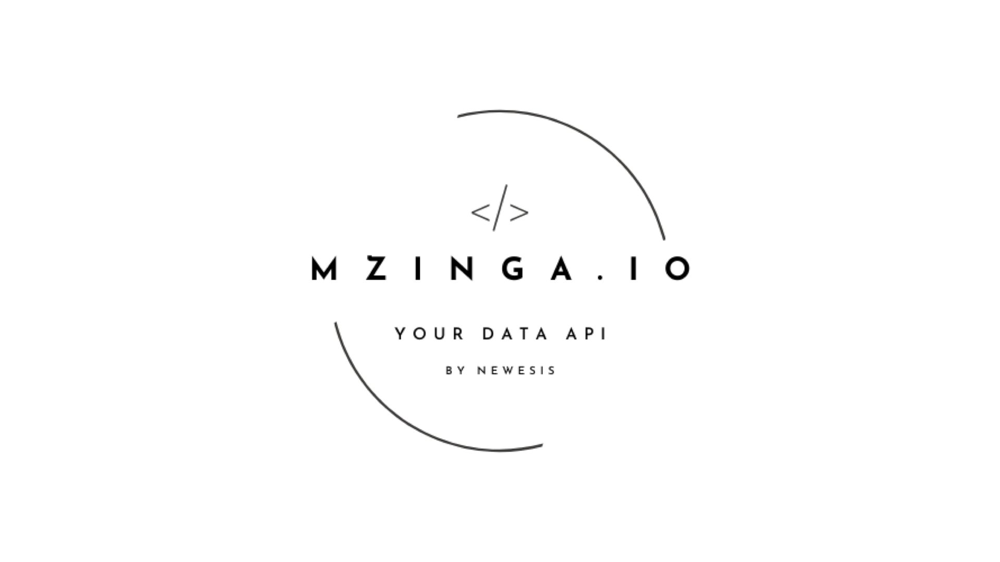

# Software Design and Architecture

## Description
A comprehensive collection of architectural laboratories developed for the **Software Design and Architecture** course during my Master's Degree in Computer Engineering at **Politecnico di Torino**. This repository documents the end-to-end architectural journey of **MZinga**, transitioning from a legacy database-coupled monolithic system to a modern, decoupled, event-driven microservices architecture. The project emphasizes advanced migration strategies, full-stack observability, and cloud-native deployment models using Kubernetes.

## Core Competencies & Architectural Patterns

* **Architecture Evolution & Migration:** Applying the **Strangler Fig Pattern** to systematically decouple monolithic components (e.g., email communication flows) into independent services without system downtime.
* **Message Brokering & Event-Driven Design:** Implementing asynchronous communication between microservices using **RabbitMQ** (exchanges, queues, vhosts) to ensure safe horizontal scaling and strict system decoupling.
* **Cloud-Native Observability:** Instrumenting distributed workers with **OpenTelemetry** for distributed tracing and spans, **Prometheus** for metrics scraping, and `structlog` for structured logging.
* **Advanced Kubernetes Deployments:** Containerizing applications with Docker and managing orchestration via **Kubernetes** and **Helm**. Implementation of complex zero-downtime deployment strategies including In-Place Rolling Updates, Blue-Green Deployments, and Canary Releases.
* **Database Decoupling:** Transitioning from legacy database-coupled Python workers to REST APIs and event-driven consumers, managing state across **MongoDB** standalone instances and replica sets.

## Tech Stack & Infrastructure

* **Languages & APIs:** Python, REST
* **Containerization & Orchestration:** Docker, Kubernetes (Minikube), Helm
* **Infrastructure & Messaging:** RabbitMQ, MongoDB
* **Observability & Monitoring:** OpenTelemetry, Prometheus
* **Cluster Management UI:** K9s, OpenLens

## Documentation

Read in order — each document builds on the previous one.

| # | Document | Contents |
|---|---|---|
| 1 | [Laboratory Introduction](docs/01-laboratory-introduction.md) | What MZinga is, why a real system matters, and the four-state architecture journey |
| 2 | [Architecture Evolution: Four States from Monolith to Event-Driven](docs/02-architecture-evolution.md) | Pattern-by-pattern walkthrough of each architectural state with code references |
| 3 | [Communications Email Flow & Decoupling Guide](docs/03-communications-email-flow.md) | Line-by-line walkthrough of the current email flow and the specific code changes to decouple it |
| 4 | [The Strangler Fig Pattern](docs/04-strangler-fig-pattern.md) | Deep dive into the primary migration pattern: origin, mechanics, and limitations |
| 5 | [Supporting Patterns Catalogue](docs/05-supporting-patterns-catalogue.md) | Full catalogue of patterns relevant across all four states |
| 5b | [Infrastructure Reference: MongoDB and RabbitMQ](docs/05b-infrastructure-reference.md) | MongoDB standalone vs replica set, RabbitMQ exchanges, queues, vhosts, and auth |
| 6 | [Lab 1 Step by Step](docs/06-lab1-step-by-step.md) | DB-coupled Python worker, feature flag, status field, end-to-end verification |
| 6b | [Lab 1 Code Snippets](docs/06-lab1-code-snippets.md) | All code snippets for Lab 1 with macOS, Linux, and Windows variants |
| 7 | [Lab 2 Step by Step](docs/07-lab2-step-by-step.md) | REST API worker (core) + event-driven RabbitMQ worker (optional extension) |
| 7b | [Lab 2 Code Snippets](docs/07-lab2-code-snippets.md) | All code snippets for Lab 2 with macOS, Linux, and Windows variants |
| 8 | [Lab 3 Step by Step](docs/08-lab3-step-by-step.md) | Observability: structured logging, OpenTelemetry traces and spans, Prometheus metrics |
| 8b | [Lab 3 Code Snippets](docs/08-lab3-code-snippets.md) | Full instrumented worker with structlog, OpenTelemetry, and Prometheus |
| 9a | [Kubernetes Introduction](docs/09a-kubernetes-introduction.md) | What Kubernetes is, core concepts (Pod, Deployment, Service), and why it matters for deployment strategies |
| 9b | [Minikube Setup](docs/09b-minikube-setup.md) | Install and run minikube on macOS, Linux, Windows WSL, and Windows native (assumes Docker already installed) |
| 9c | [Docker Setup](docs/09c-docker-setup.md) | Install Docker Engine or Docker Desktop on macOS, Linux, Windows WSL, and Windows native — reference if Docker is not already present |
| 9d | [Helm Charts](docs/09d-helm-charts.md) | From plain Kubernetes YAML to Helm: parameterisation, release tracking, application-level rollback, multi-component applications, and deploying MZinga with the official Helm chart |
| 9e | [Kubernetes UI Tools](docs/09e-k8s-ui-tools.md) | K9s (terminal UI) and OpenLens (desktop GUI) — installation on macOS, Linux, and Windows, and how to use them to observe deployments in this lab |
| 9 | [Lab 4 Step by Step](docs/09-lab4-step-by-step.md) | Deployment models: in-place rolling update, blue-green deployment, and canary release with Kubernetes |
| 9c | [Lab 4 Code Snippets](docs/09-lab4-code-snippets.md) | All Kubernetes manifests, Dockerfile, and commands for all three deployment strategies |
| 10 | [Conclusion](docs/10-conclusion.md) | The full journey across all four labs: how each architectural transition constrained the deployment strategy, why Recreate was mandatory for the v1→v2 worker switch, how RabbitMQ unlocks safe horizontal scaling, and a complete deployment timeline |